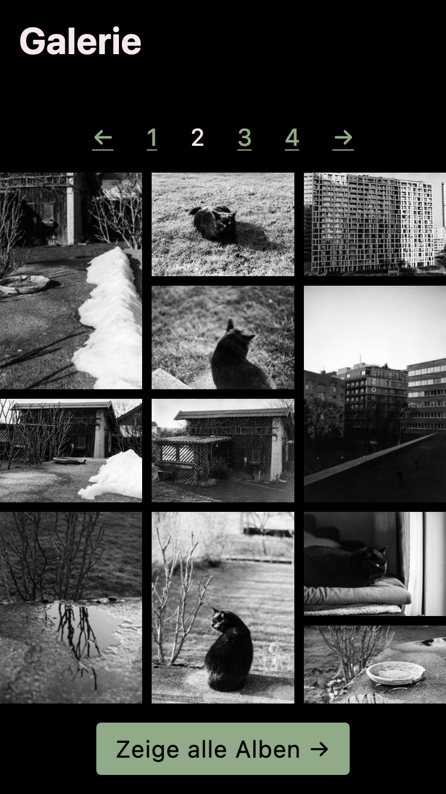
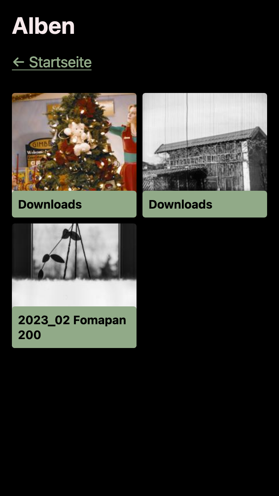
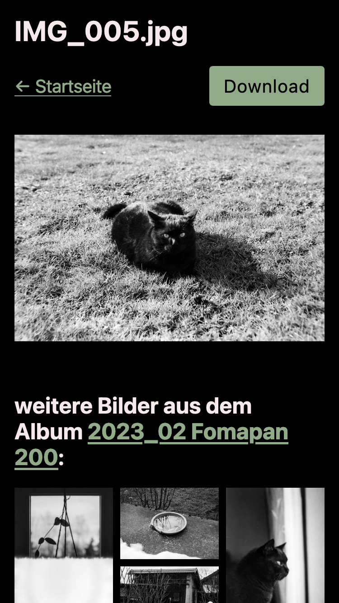

<div align="center">
  <h1>Flaskallery</h1>
  <strong>A quick & dirty Flask app to serve images as a gallery.</strong>
  <br />
  <br />
  
  
  
  <br />
  <br />
  <br />
</div>

## What is it?

This repository contains the source code of **Flaskallery**, a small gallery website, meant to serve locally stored images organized in collections, which are inferred from their file system paths.

Furthermore, it is fully equipped with an underlying API for headlessly querying the gallery.

## Getting started

### Prerequisites

The following prerequisites are needed to successfully launch this project locally:

#### Runtimes & Clients

- [Python v3.10](https://www.python.org/) for running the application
- [SQLite3](https://www.sqlite.org/) for storing image- & collection data

#### Optional prerequisites

It is generally advised to run any [Flask](https://flask.palletsprojects.com) app behind a reverse proxy. See the entry about [Self-Hosted Options](https://flask.palletsprojects.com/en/3.0.x/deploying/#self-hosted-options) in the Flask docs.

The following **environtment variables** may support in customizing the application:

- **PICTURES_ROOT**: where to look for nested images. Defaults to `~/Downloads`.
- **THUMBNAIL_ROOT**: where to store the generated thumbnails. Defaults to `./.cache`.
- **TEMP_ROOT**: where to store the generated collection archives for downloading. Defaults to the currently set `$TMPDIR` environment variable.

### Quick start

1. Install dependencies either through

   ```bash
   pipenv install
   ```

   or

   ```bash
   pip -r requirements.txt
   ```

2. Run the `picture_walk.py` file for filling the database with collections, pictures and thumbnails. Do not forget to set the correct **environment variables** and/or change into the `pipenv shell`, when using pipenv.

   ```bash
   python picture_walk.py
   ```

3. After the initial script finished, it's time to start the Flask server. Do not forget to set the correct **environment variables** either.

   ```bash
   python app.py
   ```

4. It might be a good idea to create a cronjob for periodically traverse the `$PICTURES_ROOT` for any newly added pictures and thus updating the database.

## License

Licensed under the MIT license.

Copyright ©️ 2024 [Sascha Zarhuber](https://sascha.work)
